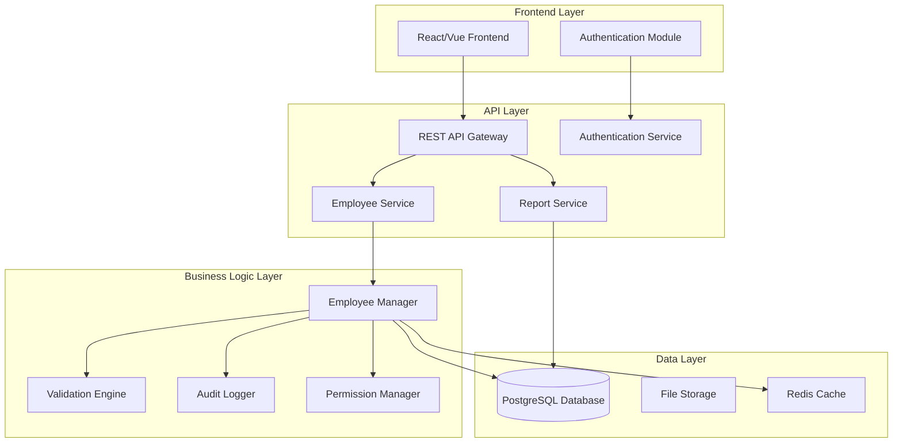

# Employee Management System Design

## Overview

The Employee Management system is designed as a modern web application with a RESTful API backend and responsive frontend interface. The architecture follows a layered approach with clear separation of concerns, supporting role-based access control, audit logging, and scalable data management. The system is designed to handle enterprise-level employee data while maintaining security, performance, and compliance requirements.

## Architecture

### High-Level Architecture



### Technology Stack

- **Frontend**: React with TypeScript, Material-UI/Ant Design for components
- **Backend**: Node.js with Express.js or Python with FastAPI
- **Database**: PostgreSQL for relational data with proper indexing
- **Caching**: Redis for session management and frequently accessed data
- **Authentication**: JWT tokens with refresh token mechanism
- **File Storage**: AWS S3 or local file system for document storage
- **API Documentation**: OpenAPI/Swagger specification

## Components and Interfaces

### Core Components

#### 1. Employee Service
**Responsibilities:**
- CRUD operations for employee records
- Employee search and filtering
- Status management and lifecycle events
- Organizational hierarchy management

**Key Methods:**
```typescript
interface EmployeeService {
  createEmployee(employeeData: CreateEmployeeRequest): Promise<Employee>
  updateEmployee(id: string, updates: UpdateEmployeeRequest): Promise<Employee>
  getEmployee(id: string): Promise<Employee>
  searchEmployees(criteria: SearchCriteria): Promise<PaginatedEmployees>
  updateEmployeeStatus(id: string, status: EmployeeStatus): Promise<Employee>
  getDirectReports(managerId: string): Promise<Employee[]>
}
```

#### 2. Authentication & Authorization Service
**Responsibilities:**
- User authentication and session management
- Role-based access control (RBAC)
- Permission validation for operations

**Roles:**
- `HR_ADMIN`: Full access to all employee data and operations
- `MANAGER`: Access to direct reports and limited employee data
- `EMPLOYEE`: Access to own profile with limited edit permissions
- `VIEWER`: Read-only access to permitted employee information

#### 3. Audit Service
**Responsibilities:**
- Track all data modifications
- Maintain compliance audit trails
- Generate audit reports

#### 4. Report Service
**Responsibilities:**
- Generate employee reports
- Export functionality (CSV, PDF)
- Data aggregation and analytics

### API Endpoints

#### Employee Management
```
GET    /api/employees              # Search/list employees
POST   /api/employees              # Create new employee
GET    /api/employees/{id}         # Get employee details
PUT    /api/employees/{id}         # Update employee
DELETE /api/employees/{id}         # Soft delete employee
PUT    /api/employees/{id}/status  # Update employee status
GET    /api/employees/{id}/history # Get employee change history
```

#### Manager Operations
```
GET    /api/managers/{id}/reports  # Get direct reports
```

#### Reporting
```
GET    /api/reports/employees      # Generate employee reports
POST   /api/reports/export         # Export employee data
```

## Data Models

### Employee Entity
```typescript
interface Employee {
  id: string                    // UUID primary key
  employeeId: string           // Human-readable employee ID
  personalInfo: PersonalInfo
  jobInfo: JobInfo
  status: EmployeeStatus
  createdAt: Date
  updatedAt: Date
  createdBy: string
  updatedBy: string
}

interface PersonalInfo {
  firstName: string
  lastName: string
  email: string
  phone?: string
  address?: Address
  dateOfBirth?: Date
  socialSecurityNumber?: string  // Encrypted
  emergencyContact?: EmergencyContact
}

interface JobInfo {
  jobTitle: string
  department: string
  managerId?: string
  startDate: Date
  employmentType: 'FULL_TIME' | 'PART_TIME' | 'CONTRACT' | 'INTERN'
  salary?: number              // Encrypted, restricted access
  location: string
}

interface EmployeeStatus {
  current: 'ACTIVE' | 'INACTIVE' | 'TERMINATED' | 'ON_LEAVE'
  effectiveDate: Date
  reason?: string
  notes?: string
}
```

### Audit Log Entity
```typescript
interface AuditLog {
  id: string
  entityType: string           // 'EMPLOYEE'
  entityId: string
  action: 'CREATE' | 'UPDATE' | 'DELETE' | 'STATUS_CHANGE'
  changes: Record<string, any> // JSON field storing before/after values
  performedBy: string
  performedAt: Date
  ipAddress?: string
}
```

### Database Schema Design

#### Key Tables
- `employees` - Main employee data
- `employee_status_history` - Track status changes over time
- `audit_logs` - Comprehensive audit trail
- `users` - System users and authentication
- `roles` - Role definitions
- `user_roles` - User-role assignments
- `departments` - Department master data

#### Indexing Strategy
- Primary indexes on `id` fields
- Composite indexes on frequently searched fields (`email`, `employee_id`, `department`)
- Full-text search indexes on `first_name`, `last_name` for search functionality
- Indexes on `manager_id` for organizational hierarchy queries

## Error Handling

### Error Categories
1. **Validation Errors** (400): Invalid input data, missing required fields
2. **Authentication Errors** (401): Invalid credentials, expired tokens
3. **Authorization Errors** (403): Insufficient permissions
4. **Not Found Errors** (404): Employee or resource not found
5. **Conflict Errors** (409): Duplicate email, business rule violations
6. **Server Errors** (500): Database errors, external service failures

### Error Response Format
```typescript
interface ErrorResponse {
  error: {
    code: string
    message: string
    details?: Record<string, any>
    timestamp: string
    requestId: string
  }
}
```

### Error Handling Strategy
- Centralized error handling middleware
- Structured logging with correlation IDs
- User-friendly error messages for frontend
- Detailed error logging for debugging
- Graceful degradation for non-critical failures

## Testing Strategy

### Unit Testing
- **Coverage Target**: 90%+ for business logic components
- **Focus Areas**: Employee service methods, validation logic, permission checks
- **Tools**: Jest/Vitest for JavaScript, pytest for Python
- **Mock Strategy**: Mock external dependencies (database, cache, file storage)

### Integration Testing
- **API Endpoint Testing**: Test all REST endpoints with various scenarios
- **Database Integration**: Test data persistence and retrieval
- **Authentication Flow**: Test role-based access control
- **Tools**: Supertest for API testing, test containers for database

### End-to-End Testing
- **User Workflows**: Complete employee lifecycle scenarios
- **Cross-Role Testing**: Test different user role interactions
- **Tools**: Playwright or Cypress for browser automation
- **Test Data**: Automated test data setup and cleanup

### Performance Testing
- **Load Testing**: Simulate concurrent user operations
- **Database Performance**: Query optimization and indexing validation
- **API Response Times**: Ensure sub-200ms response times for critical operations
- **Tools**: Artillery or k6 for load testing

### Security Testing
- **Authentication Testing**: Token validation, session management
- **Authorization Testing**: Role-based access control validation
- **Data Protection**: Ensure sensitive data encryption
- **Input Validation**: SQL injection, XSS prevention testing

### Test Data Management
- **Seed Data**: Consistent test datasets for development and testing
- **Data Privacy**: Anonymized production-like data for testing
- **Cleanup Strategy**: Automated test data cleanup after test runs