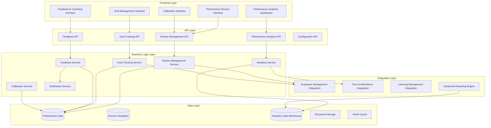

# Performance Management System Design

## Overview

The Performance Management system provides comprehensive tools for employee performance evaluation, goal tracking, continuous feedback, and organizational performance analytics. The system is designed to integrate seamlessly with existing Employee Management and Time and Attendance systems, leveraging organizational hierarchy and performance data to support data-driven HR decisions. The architecture supports configurable review processes, multi-source feedback, goal alignment, and advanced analytics for talent management and organizational development.

## Architecture

### High-Level Architecture



### Integration Architecture

The Performance Management system integrates with existing systems:
- **Employee Management**: Leverages organizational hierarchy, employee data, and RBAC
- **Time & Attendance**: Incorporates attendance data and productivity metrics
- **Learning Management**: Links development plans with training recommendations
- **Compensation Management**: Provides performance data for merit increases and bonuses

## Components and Interfaces

### Core Components

#### 1. Review Management Service
**Responsibilities:**
- Performance review lifecycle management
- Review template configuration and versioning
- Approval workflow orchestration
- Review cycle automation

**Key Methods:**
```typescript
interface ReviewManagementService {
  createReview(reviewData: CreateReviewRequest): Promise<PerformanceReview>
  updateReview(reviewId: string, updates: ReviewUpdate): Promise<PerformanceReview>
  submitReview(reviewId: string, submitterId: string): Promise<PerformanceReview>
  approveReview(reviewId: string, approverId: string): Promise<PerformanceReview>
  getReviewsForEmployee(employeeId: string, dateRange?: DateRange): Promise<PerformanceReview[]>
  getReviewsForManager(managerId: string, status?: ReviewStatus): Promise<PerformanceReview[]>
  createReviewCycle(cycleConfig: ReviewCycleConfig): Promise<ReviewCycle>
  getReviewTemplate(templateId: string, version?: number): Promise<ReviewTemplate>
}
```

#### 2. Goal Tracking Service
**Responsibilities:**
- Goal creation and progress tracking
- Goal alignment with organizational objectives
- Milestone management and notifications
- Goal achievement analytics

**Key Methods:**
```typescript
interface GoalTrackingService {
  createGoal(goalData: CreateGoalRequest): Promise<PerformanceGoal>
  updateGoalProgress(goalId: string, progress: ProgressUpdate): Promise<PerformanceGoal>
  getGoalsForEmployee(employeeId: string, status?: GoalStatus): Promise<PerformanceGoal[]>
  alignGoalWithObjectives(goalId: string, objectiveIds: string[]): Promise<GoalAlignment>
  calculateGoalAchievement(employeeId: string, period: ReviewPeriod): Promise<GoalAchievementSummary>
  getGoalInsights(goalId: string): Promise<GoalInsights>
}
```

#### 3. Feedback Service
**Responsibilities:**
- Continuous feedback collection and management
- Feedback categorization and tagging
- Recognition and coaching workflow
- Feedback aggregation for reviews

**Key Methods:**
```typescript
interface FeedbackService {
  provideFeedback(feedbackData: FeedbackRequest): Promise<Feedback>
  getFeedbackForEmployee(employeeId: string, filters: FeedbackFilters): Promise<Feedback[]>
  acknowledgeFeedback(feedbackId: string, response?: string): Promise<Feedback>
  aggregateFeedbackForReview(employeeId: string, period: ReviewPeriod): Promise<FeedbackSummary>
  createRecognition(recognitionData: RecognitionRequest): Promise<Recognition>
  getFeedbackInsights(employeeId: string): Promise<FeedbackInsights>
}
```

#### 4. Analytics Service
**Responsibilities:**
- Performance data analysis and reporting
- Trend identification and predictive analytics
- Manager effectiveness metrics
- Organizational performance insights

**Key Methods:**
```typescript
interface AnalyticsService {
  generatePerformanceReport(criteria: ReportCriteria): Promise<PerformanceReport>
  getPerformanceTrends(employeeId: string, timeframe: Timeframe): Promise<PerformanceTrends>
  analyzeManagerEffectiveness(managerId: string): Promise<ManagerEffectivenessReport>
  identifyHighPerformers(criteria: TalentCriteria): Promise<TalentPool>
  getOrganizationalInsights(orgUnit: string): Promise<OrganizationalInsights>
  predictPerformanceRisk(employeeId: string): Promise<PerformanceRiskAssessment>
}
```

#### 5. Calibration Service
**Responsibilities:**
- Performance rating calibration across teams
- Bias detection and correction
- Rating distribution analysis
- Calibration session management

### API Endpoints

#### Review Management
```
POST   /api/reviews                    # Create performance review
GET    /api/reviews                    # Get reviews (filtered by role/status)
PUT    /api/reviews/{id}               # Update review
POST   /api/reviews/{id}/submit        # Submit review for approval
POST   /api/reviews/{id}/approve       # Approve review
GET    /api/reviews/{id}/history       # Get review history
POST   /api/review-cycles              # Create review cycle
GET    /api/review-templates           # Get available templates
```

#### Goal Management
```
POST   /api/goals                      # Create performance goal
GET    /api/goals                      # Get goals (filtered)
PUT    /api/goals/{id}                 # Update goal
POST   /api/goals/{id}/progress        # Update goal progress
GET    /api/goals/{id}/insights        # Get goal insights
POST   /api/goals/{id}/align           # Align goal with objectives
```

#### Feedback Management
```
POST   /api/feedback                   # Provide feedback
GET    /api/feedback                   # Get feedback (filtered)
POST   /api/feedback/{id}/acknowledge  # Acknowledge feedback
GET    /api/feedback/summary           # Get feedback summary
POST   /api/recognition                # Create recognition
```

#### Analytics and Reporting
```
GET    /api/analytics/performance      # Performance analytics
GET    /api/analytics/trends           # Performance trends
GET    /api/analytics/manager-effectiveness # Manager metrics
GET    /api/analytics/talent-pool      # High performer identification
POST   /api/reports/generate           # Generate custom reports
```

#### Calibration
```
GET    /api/calibration/sessions       # Get calibration sessions
POST   /api/calibration/sessions       # Create calibration session
PUT    /api/calibration/ratings        # Adjust ratings
GET    /api/calibration/analysis       # Rating distribution analysis
```

## Data Models

### Performance Review Entity
```typescript
interface PerformanceReview {
  id: string
  employeeId: string
  reviewerId: string
  reviewPeriod: ReviewPeriod
  templateId: string
  templateVersion: number
  status: ReviewStatus
  overallRating?: number
  competencyRatings: CompetencyRating[]
  goalAssessments: GoalAssessment[]
  developmentPlan?: DevelopmentPlan
  managerComments?: string
  employeeComments?: string
  selfAssessment?: SelfAssessment
  submittedAt?: Date
  approvedAt?: Date
  approvedBy?: string
  createdAt: Date
  updatedAt: Date
}

interface CompetencyRating {
  competencyId: string
  competencyName: string
  rating: number
  weight: number
  comments?: string
  examples?: string[]
}

interface GoalAssessment {
  goalId: string
  achievementLevel: number
  impact: 'LOW' | 'MEDIUM' | 'HIGH'
  comments?: string
}
```

### Performance Goal Entity
```typescript
interface PerformanceGoal {
  id: string
  employeeId: string
  title: string
  description: string
  category: GoalCategory
  priority: 'LOW' | 'MEDIUM' | 'HIGH' | 'CRITICAL'
  targetDate: Date
  status: GoalStatus
  progress: number
  milestones: Milestone[]
  successCriteria: SuccessCriteria[]
  alignedObjectives: string[]
  createdBy: string
  approvedBy?: string
  createdAt: Date
  updatedAt: Date
}

interface Milestone {
  id: string
  title: string
  description?: string
  targetDate: Date
  completed: boolean
  completedAt?: Date
  evidence?: string[]
}

interface SuccessCriteria {
  id: string
  description: string
  measurementMethod: string
  targetValue: number
  currentValue?: number
  achieved: boolean
}
```

### Feedback Entity
```typescript
interface Feedback {
  id: string
  fromUserId: string
  toEmployeeId: string
  type: FeedbackType
  category: FeedbackCategory
  title: string
  content: string
  competencyTags: string[]
  goalReferences: string[]
  visibility: 'PRIVATE' | 'MANAGER' | 'EMPLOYEE' | 'PUBLIC'
  acknowledged: boolean
  acknowledgedAt?: Date
  employeeResponse?: string
  createdAt: Date
}

enum FeedbackType {
  RECOGNITION = 'RECOGNITION',
  COACHING = 'COACHING',
  DEVELOPMENTAL = 'DEVELOPMENTAL',
  CORRECTIVE = 'CORRECTIVE'
}

enum FeedbackCategory {
  PERFORMANCE = 'PERFORMANCE',
  BEHAVIOR = 'BEHAVIOR',
  SKILLS = 'SKILLS',
  COLLABORATION = 'COLLABORATION',
  LEADERSHIP = 'LEADERSHIP'
}
```

### Review Template Entity
```typescript
interface ReviewTemplate {
  id: string
  name: string
  description: string
  version: number
  competencies: CompetencyDefinition[]
  ratingScale: RatingScale
  sections: ReviewSection[]
  workflows: ApprovalWorkflow[]
  isActive: boolean
  applicableRoles: string[]
  createdBy: string
  createdAt: Date
}

interface CompetencyDefinition {
  id: string
  name: string
  description: string
  weight: number
  behaviorIndicators: BehaviorIndicator[]
  ratingGuidelines: RatingGuideline[]
}

interface RatingScale {
  id: string
  name: string
  levels: RatingLevel[]
  allowHalfPoints: boolean
}

interface RatingLevel {
  value: number
  label: string
  description: string
  color?: string
}
```

### Database Schema Design

#### Key Tables
- `performance_reviews` - Review records and ratings
- `performance_goals` - Employee goals and objectives
- `goal_progress` - Goal progress tracking
- `feedback` - Continuous feedback records
- `review_templates` - Configurable review templates
- `review_cycles` - Review period configurations
- `competency_definitions` - Competency frameworks
- `calibration_sessions` - Rating calibration records
- `development_plans` - Employee development planning

#### Indexing Strategy
- Composite indexes on `employee_id + review_period` for performance queries
- Indexes on `status` and `due_date` for workflow management
- Full-text indexes on feedback content for search functionality
- Indexes on `manager_id` for manager dashboard queries
- Time-series indexes for analytics and trend analysis

## Error Handling

### Performance Management Specific Errors
1. **Review State Errors** (409): Invalid review status transitions, duplicate reviews
2. **Goal Validation Errors** (400): Invalid goal criteria, unrealistic targets
3. **Feedback Errors** (403): Inappropriate feedback recipients, visibility violations
4. **Template Errors** (400): Invalid template configurations, missing competencies
5. **Calibration Errors** (409): Rating conflicts, unauthorized calibration changes

### Workflow Errors
1. **Approval Errors** (403): Insufficient permissions, invalid approval sequence
2. **Deadline Errors** (400): Past due dates, invalid review periods
3. **Dependency Errors** (409): Missing prerequisites, circular dependencies

## Testing Strategy

### Performance Review Testing
- **Review Lifecycle**: Test complete review process from creation to approval
- **Template Configuration**: Validate template versioning and migration
- **Rating Calculations**: Test weighted scoring and overall rating computation
- **Workflow Management**: Test approval processes and notification triggers

### Goal Management Testing
- **Goal Tracking**: Test progress updates and milestone completion
- **Goal Alignment**: Validate organizational objective alignment
- **Achievement Calculation**: Test goal completion and impact assessment
- **Notification System**: Test reminder and deadline notifications

### Feedback System Testing
- **Feedback Workflows**: Test all feedback types and acknowledgment processes
- **Aggregation Logic**: Validate feedback summarization for reviews
- **Visibility Controls**: Test feedback privacy and access permissions
- **Recognition System**: Test recognition workflows and notifications

### Analytics Testing
- **Report Generation**: Test all report types with various filters and date ranges
- **Trend Analysis**: Validate performance trend calculations and visualizations
- **Manager Metrics**: Test manager effectiveness calculations
- **Predictive Analytics**: Test performance risk assessment algorithms

### Integration Testing
- **Employee System Integration**: Test organizational hierarchy and role synchronization
- **Time System Integration**: Test attendance and productivity data integration
- **Notification Integration**: Test all notification triggers and delivery methods
- **Security Integration**: Test role-based access control and data protection

### Performance Testing
- **Large Dataset Handling**: Test system performance with thousands of reviews and goals
- **Concurrent Operations**: Test simultaneous review submissions and updates
- **Analytics Performance**: Test complex report generation and dashboard loading
- **Real-time Updates**: Test live progress tracking and notification delivery