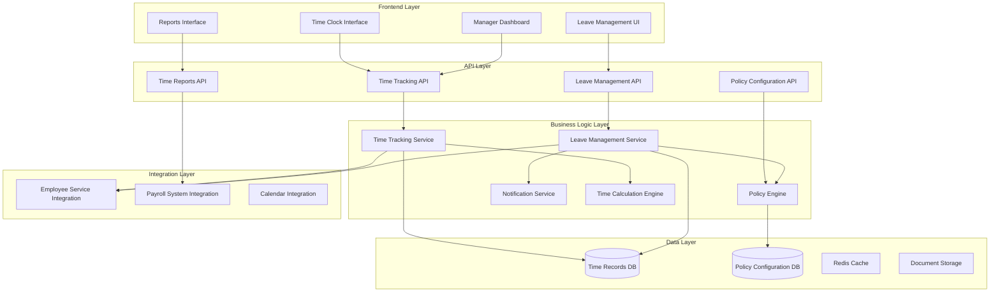

# Time and Attendance Management System Design

## Overview

The Time and Attendance Management system extends the Employee Management foundation to provide comprehensive workforce time tracking, leave management, and attendance monitoring capabilities. The system is designed to integrate seamlessly with existing employee data while providing real-time time tracking, automated policy enforcement, and robust reporting capabilities. The architecture supports various work arrangements, flexible scheduling, and compliance with labor regulations.

## Architecture

### High-Level Architecture



### Integration with Employee Management

The Time and Attendance system leverages the existing Employee Management infrastructure:
- **Employee Data**: References employee records for authentication and organizational hierarchy
- **Role-Based Access**: Uses existing RBAC system with additional time-specific permissions
- **Audit Trail**: Extends existing audit logging for time and leave transactions
- **Database**: Shares PostgreSQL instance with separate schemas for time data

## Components and Interfaces

### Core Components

#### 1. Time Tracking Service
**Responsibilities:**
- Clock in/out operations with validation
- Break time management
- Time calculation and overtime detection
- Manual time entry with approval workflows

**Key Methods:**
```typescript
interface TimeTrackingService {
  clockIn(employeeId: string, location?: GeoLocation): Promise<TimeEntry>
  clockOut(employeeId: string): Promise<TimeEntry>
  startBreak(employeeId: string, breakType: BreakType): Promise<BreakEntry>
  endBreak(employeeId: string): Promise<BreakEntry>
  submitManualEntry(entry: ManualTimeEntry): Promise<TimeEntry>
  getCurrentStatus(employeeId: string): Promise<EmployeeTimeStatus>
  getTimeEntries(employeeId: string, dateRange: DateRange): Promise<TimeEntry[]>
}
```

#### 2. Leave Management Service
**Responsibilities:**
- Time-off request processing
- Leave balance calculations
- Approval workflow management
- Policy compliance validation

**Key Methods:**
```typescript
interface LeaveManagementService {
  submitLeaveRequest(request: LeaveRequest): Promise<LeaveRequest>
  approveLeaveRequest(requestId: string, approverId: string, notes?: string): Promise<LeaveRequest>
  denyLeaveRequest(requestId: string, approverId: string, reason: string): Promise<LeaveRequest>
  getLeaveBalance(employeeId: string): Promise<LeaveBalance[]>
  getPendingRequests(managerId: string): Promise<LeaveRequest[]>
  checkLeaveEligibility(employeeId: string, leaveType: string, dates: DateRange): Promise<EligibilityResult>
}
```

#### 3. Policy Engine
**Responsibilities:**
- Leave policy configuration and enforcement
- Accrual calculations
- Overtime rules and calculations
- Compliance monitoring

**Key Methods:**
```typescript
interface PolicyEngine {
  calculateLeaveAccrual(employeeId: string, accrualPeriod: AccrualPeriod): Promise<AccrualResult>
  validateLeaveRequest(request: LeaveRequest): Promise<ValidationResult>
  calculateOvertime(timeEntries: TimeEntry[], payPeriod: PayPeriod): Promise<OvertimeCalculation>
  applyPolicyRules(employeeId: string, operation: PolicyOperation): Promise<PolicyResult>
  updateLeaveBalances(accrualDate: Date): Promise<BalanceUpdateResult[]>
}
```

#### 4. Time Calculation Engine
**Responsibilities:**
- Work hours calculations
- Overtime detection and calculation
- Break time deductions
- Pay period summaries

### API Endpoints

#### Time Tracking
```
POST   /api/time/clock-in           # Clock in employee
POST   /api/time/clock-out          # Clock out employee
POST   /api/time/break/start        # Start break
POST   /api/time/break/end          # End break
GET    /api/time/status/{employeeId} # Get current time status
GET    /api/time/entries            # Get time entries (with filters)
POST   /api/time/manual-entry       # Submit manual time entry
PUT    /api/time/entries/{id}       # Update time entry (with approval)
```

#### Leave Management
```
POST   /api/leave/requests          # Submit leave request
GET    /api/leave/requests          # Get leave requests (filtered by role)
PUT    /api/leave/requests/{id}/approve # Approve leave request
PUT    /api/leave/requests/{id}/deny    # Deny leave request
GET    /api/leave/balances/{employeeId} # Get leave balances
GET    /api/leave/calendar          # Get team leave calendar
```

#### Policy Management
```
GET    /api/policies/leave          # Get leave policies
POST   /api/policies/leave          # Create leave policy
PUT    /api/policies/leave/{id}     # Update leave policy
GET    /api/policies/overtime       # Get overtime policies
POST   /api/policies/accrual/run    # Run accrual calculation
```

#### Reporting
```
GET    /api/reports/attendance      # Generate attendance reports
GET    /api/reports/time-summary    # Get time summary reports
GET    /api/reports/leave-usage     # Get leave usage reports
POST   /api/reports/payroll-export  # Export payroll data
```

## Data Models

### Time Entry Entity
```typescript
interface TimeEntry {
  id: string
  employeeId: string
  clockInTime: Date
  clockOutTime?: Date
  breakEntries: BreakEntry[]
  totalHours?: number
  regularHours?: number
  overtimeHours?: number
  location?: GeoLocation
  status: 'ACTIVE' | 'COMPLETED' | 'PENDING_APPROVAL'
  manualEntry: boolean
  approvedBy?: string
  approvedAt?: Date
  notes?: string
  createdAt: Date
  updatedAt: Date
}

interface BreakEntry {
  id: string
  timeEntryId: string
  breakType: 'LUNCH' | 'SHORT_BREAK' | 'PERSONAL'
  startTime: Date
  endTime?: Date
  duration?: number
  paid: boolean
}
```

### Leave Request Entity
```typescript
interface LeaveRequest {
  id: string
  employeeId: string
  leaveType: LeaveType
  startDate: Date
  endDate: Date
  totalDays: number
  totalHours: number
  reason?: string
  status: 'PENDING' | 'APPROVED' | 'DENIED' | 'CANCELLED'
  submittedAt: Date
  reviewedBy?: string
  reviewedAt?: Date
  reviewNotes?: string
  attachments?: string[]
}

interface LeaveType {
  id: string
  name: string
  code: string
  paid: boolean
  requiresApproval: boolean
  maxConsecutiveDays?: number
  advanceNoticeRequired?: number
  allowsPartialDays: boolean
  accrualBased: boolean
}
```

### Leave Balance Entity
```typescript
interface LeaveBalance {
  id: string
  employeeId: string
  leaveTypeId: string
  currentBalance: number
  accrualRate: number
  accrualPeriod: 'MONTHLY' | 'BIWEEKLY' | 'ANNUAL'
  maxBalance?: number
  carryoverLimit?: number
  lastAccrualDate: Date
  yearToDateUsed: number
  yearToDateAccrued: number
}
```

### Policy Configuration Entity
```typescript
interface LeavePolicy {
  id: string
  name: string
  leaveTypeId: string
  eligibilityRules: EligibilityRule[]
  accrualRules: AccrualRule[]
  usageRules: UsageRule[]
  effectiveDate: Date
  endDate?: Date
  applicableGroups: string[]
}

interface OvertimePolicy {
  id: string
  name: string
  dailyOvertimeThreshold: number
  weeklyOvertimeThreshold: number
  overtimeMultiplier: number
  doubleTimeThreshold?: number
  applicableGroups: string[]
}
```

### Database Schema Design

#### Key Tables
- `time_entries` - Clock in/out records
- `break_entries` - Break time tracking
- `leave_requests` - Time-off requests
- `leave_balances` - Employee leave balances
- `leave_types` - Leave type definitions
- `leave_policies` - Policy configurations
- `overtime_policies` - Overtime calculation rules
- `accrual_transactions` - Leave accrual history
- `time_corrections` - Manual time entry corrections

#### Indexing Strategy
- Composite indexes on `employee_id + date` for time queries
- Indexes on `status` and `submitted_at` for leave request filtering
- Indexes on `leave_type_id` and `employee_id` for balance queries
- Partial indexes on active time entries for performance

## Error Handling

### Time Tracking Specific Errors
1. **Clock State Errors** (409): Already clocked in/out, invalid state transitions
2. **Time Validation Errors** (400): Future timestamps, excessive hours, invalid break times
3. **Location Errors** (403): Geofencing violations, unauthorized locations
4. **Approval Errors** (403): Insufficient permissions for manual entries

### Leave Management Specific Errors
1. **Balance Errors** (409): Insufficient leave balance, negative balances
2. **Policy Violations** (400): Advance notice requirements, blackout periods
3. **Conflict Errors** (409): Overlapping requests, team coverage issues
4. **Workflow Errors** (403): Invalid approval states, unauthorized actions

### Error Response Enhancement
```typescript
interface TimeAttendanceError extends ErrorResponse {
  error: {
    code: string
    message: string
    context: {
      employeeId?: string
      timeEntryId?: string
      leaveRequestId?: string
      policyViolations?: string[]
    }
    suggestions?: string[]
  }
}
```

## Testing Strategy

### Time Tracking Testing
- **Clock Operations**: Test all clock in/out scenarios including edge cases
- **Time Calculations**: Validate overtime, break deductions, and total hours
- **Geolocation**: Test location-based restrictions and validation
- **Manual Entries**: Test approval workflows and correction processes

### Leave Management Testing
- **Request Workflows**: Test complete leave request lifecycle
- **Balance Calculations**: Validate accrual and deduction accuracy
- **Policy Enforcement**: Test all policy rules and violations
- **Approval Processes**: Test manager and HR approval scenarios

### Integration Testing
- **Employee System Integration**: Test data consistency and synchronization
- **Payroll Integration**: Validate export formats and data accuracy
- **Calendar Integration**: Test schedule synchronization
- **Notification System**: Test all notification triggers and delivery

### Performance Testing
- **Concurrent Clock Operations**: Test multiple simultaneous clock in/out operations
- **Report Generation**: Test large dataset report performance
- **Real-time Updates**: Test dashboard refresh and status updates
- **Batch Processing**: Test accrual calculations and policy updates

### Compliance Testing
- **Labor Law Compliance**: Test overtime calculations and break requirements
- **Audit Trail**: Validate complete audit logging for all operations
- **Data Retention**: Test data archival and retention policies
- **Security**: Test access controls and data protection measures